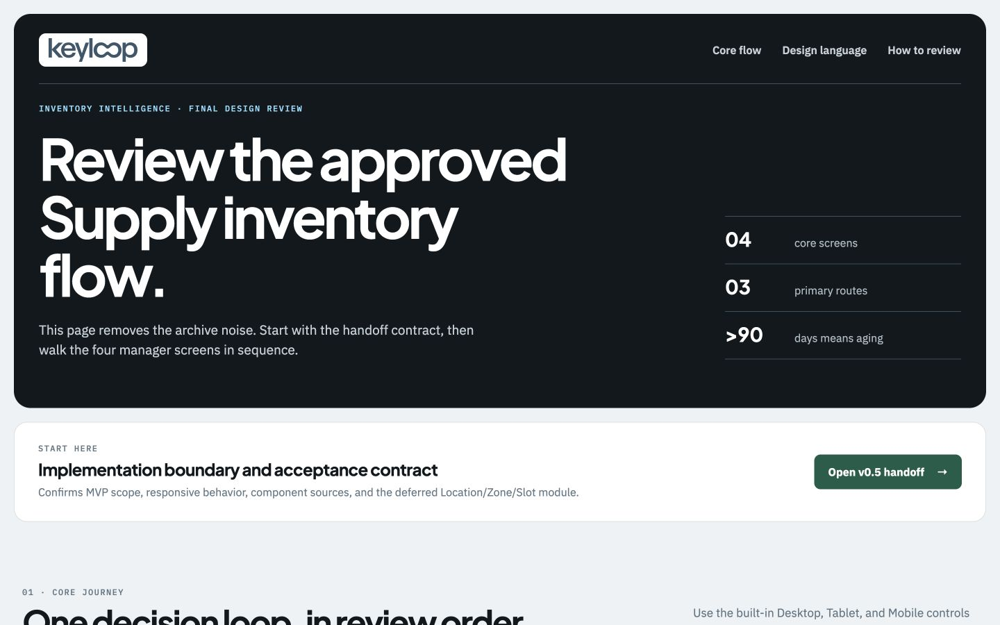

# Final design review

`design/final` is the curated entrypoint for reviewing the approved Keyloop
Inventory Intelligence design. It does not replace or duplicate the versioned
source artifacts.



## Open the review

Fastest option:

1. Double-click `index.html`.
2. Open the v0.5 handoff first.
3. Review the four core screens in order.

If the browser restricts local assets, run the repository preview server:

```bash
npm run dev
```

Then open:

```text
http://127.0.0.1:5173/design/final/index.html
```

The port may change when `5173` is already in use; use the URL printed by Vite.

## Recommended review order

1. **v0.5 handoff** — scope and implementation boundary.
2. **Overview** — aging-stock signal.
3. **Inventory** — filtering and stock comparison.
4. **Inventory Unit** — proposed-action decision.
5. **Activity** — persisted evidence.
6. **Design language** — consult only when reviewing or implementing a
   component family.

Each core prototype includes Desktop, Tablet, and Mobile controls. The source
screens also link to the next screen in the manager journey.

## Scope rules

- Primary navigation: **Overview / Inventory / Activity**.
- Inventory Unit detail is contextual, not a fourth primary route.
- Stock is aging only when `daysInStock > 90`.
- Vehicle Master is supporting normalized data.
- Locations, Zones, and Slots are deferred and intentionally have no link in
  the final review hub.

Older fixture screens may still show legacy Locations or Master Data labels.
The [v0.5 scope](../v0.5-design-handoff/scope.md) overrides those labels for the
submission MVP.

## File ownership

- Edit the relevant versioned folder when a design changes.
- Update `final/index.html` only when the approved review set changes.
- Re-capture `previews/final-review-index.jpg` after changing the final hub.
- Do not move or delete versioned design evidence; it preserves review history.
